# 서울시 공공자전거(따릉이) 이용 행태 및 수요 예측 모델링

**기상 요인과 상권 특성의 Interaction 및 Non-linear Analysis를 중심으로**

---

## 1. 프로젝트 개요 및 배경

본 프로젝트는 공유 모빌리티 서비스인 서울시 공공자전거(따릉이)의 이용 데이터를 활용하여 기상 요인과 공간적 입지 특성이 대여 수요에 미치는 복합적인 영향력을 통계학적 방법론과 머신러닝 모델을 통해 정밀하게 규명하는 것을 목적으로 합니다. 

실외 활동에 의존하는 자전거 대여 특성상 기상 조건은 대여량에 결정적인 영향을 미치지만, 이러한 영향력은 상권의 입지 특성(업무 지구, 대학가, 공원 및 여가 지역)에 따라 다르게 발현될 수 있습니다. 본 연구에서는 단순 선형 관계를 넘어서는 교호작용(Interaction Effect) 및 비선형적 관계(Non-linear Pattern)를 실증 분석하고, 시계열 데이터의 자기상관성(Autocorrelation) 및 불균형 데이터의 표준오차 왜곡 현상을 해결함으로써 통계적 신뢰성을 확보한 최적의 수요 예측 모델을 제안합니다.

### 핵심 연구 질문 및 분석 목적
* **상권 유형별 수요 패턴 차이 및 교호작용 규명:** 직장인 통근 중심의 오피스 상권과 나들이 수요 중심의 한강/여가 상권은 주말 및 기온 변화에 대해 서로 다른 반응 양상을 보이는가?
* **기상 요인에 따른 비선형 임계점 탐색:** 기온 상승이 대여 수요를 무제한으로 증가시키는가? 미세먼지와 강수량은 특정 임계치를 넘을 때 자전거 활동을 어떻게 차단하는가?
* **도시 여가 패턴으로서의 순환 이용 분석:** 한강 공원 등 여가 지역 내에서의 대여는 단순 통행 목적의 이동과 주행 시간 및 기온 민감도 측면에서 어떻게 차별화되는가?
* **통계적 가정 검증 및 모델 보정:** 시계열 잔차의 자기상관을 통제하고, 소표본 변수에 대한 통계적 유의성을 왜곡 없이 평가할 수 있는가?

---

## 2. 사용 데이터셋 및 변수 정의

### 데이터셋 구축 및 결합
* **분석 대상 기간:** 2026년 3월 1일 ~ 2026년 5월 21일 (봄철 기상 급변기 및 야외 활동 활성화 시기)
* **원천 데이터 가공:**
  - 서울열린데이터광장의 대여소별 대여/반납 이력 데이터를 시간 단위로 파싱하여 상권 그룹별로 집계 및 일별 병합.
  - 기상청 ASOS(종관기상관측) 및 PM10(황사관측) 데이터를 수집하여 일평균 기온, 일강수량, 일평균 미세먼지 농도 변수로 결합.
  - 학사 일정(시험기간) 정보 및 법정공휴일 캘린더 정보를 매핑하여 종합 분석 데이터셋 구축.

### 원천 데이터 출처 (Data Sources)
본 분석에서 연동 및 가공하여 사용한 원천 공공 데이터셋의 출처는 다음과 같습니다.
* **서울시 공공자전거 대여소별 대여/반납 승객수 정보:** [서울열린데이터광장 공공자전거 대여정보](https://data.seoul.go.kr/dataList/OA-21229/F/1/datasetView.do)
* **서울시 공공자전거 대여소 마스터 정보:** [서울열린데이터광장 공공자전거 대여소 정보](https://data.seoul.go.kr/dataList/OA-21235/S/1/datasetView.do)
* **기상청 종관기상관측 (ASOS) 데이터:** [기상청 기상자료개방포털 종관기상관측](https://data.kma.go.kr/data/grnd/selectAsosRltmList.do?pgmNo=36)
* **기상청 황사관측 (PM10) 데이터:** [기상청 기상자료개방포털 황사관측](https://data.kma.go.kr/data/climate/selectDustRltmList.do?pgmNo=68)

### 상권 유형 정의 (대여소 그룹화)
서울시의 입지 특징을 대변하는 세 가지 주요 거점으로 대여소를 분류하였습니다:
1. **Office (오피스 상권):** 여의도역, 광화문역 등 직장인 통근 수요가 밀집하여 출퇴근 시간대에 이용이 급증하는 지역.
2. **Leisure (여가 상권):** 뚝섬유원지, 망원 한강공원 등 한강 변 및 여가 시설 주변으로 주말 및 공원 나들이 수요가 집중되는 지역.
3. **University (대학가 상권):** 주요 대학 인근의 대여소로 대학생들의 등하교 및 생활권 이동 수요가 높은 지역.

### 데이터 사전 정의서 (Data Dictionary)

| 변수명 | 변수 유형 | 역할 | 설명 |
| :--- | :--- | :--- | :--- |
| **rentals** | Numerical | **Target** | 일별 해당 상권 대여소 그룹의 총 대여 건수 |
| **date** | Temporal | Index | 관측 일자 (YYYY-MM-DD) |
| `station_type` | Categorical | Predictor | 상권 유형 (Office, Leisure, University) |
| **temp** | Numerical | Predictor | 일평균 기온 (°C) |
| **precip** | Numerical | Predictor | 일강수량 (mm) |
| **pm10** | Numerical | Predictor | 일평균 미세먼지 농도 ($\mu g/m^3$, PM10) |
| `is_weekend` | Binary | Predictor | 주말 및 대체휴일 여부 (주말/대체휴일 = 1, 평일 = 0) |
| `is_holiday` | Binary | Predictor | 법정 공휴일 여부 (어린이날, 근로자의 날 등 = 1, 평일 = 0) |
| `is_exam` | Binary | Predictor | 대학 중간/기말 시험기간 여부 (4월 중순 등 = 1, 평소 = 0) |

---

## 3. 통계적 데이터 분석 방법론 및 수학적 기반

### 3.1. Exploratory Data Analysis (EDA)

#### Pearson 상관계수
연속형 변수들 간의 선형 관계를 파악하고 다중공선성 위험을 정량적으로 예방하기 위해 Pearson 상관계수를 사용합니다. 두 변수 $X, Y$에 대한 상관계수 $r$은 다음과 같이 정의됩니다.

$$r = \frac{\sum_ {i_ {1}}^ {n} (X_ {i} - \bar{X})(Y_ {i} - \bar{Y})}{\sqrt{\sum_ {i_ {1}}^ {n} (X_ {i} - \bar{X})^ {2} \sum_ {i_ {1}}^ {n} (Y_ {i} - \bar{Y})^ {2}}}$$

상권 유형과 주말 여부의 상호 분포적 패턴을 한눈에 식별하기 위해 상권 유형별 대여량의 차이를 상자로 나타내었습니다.

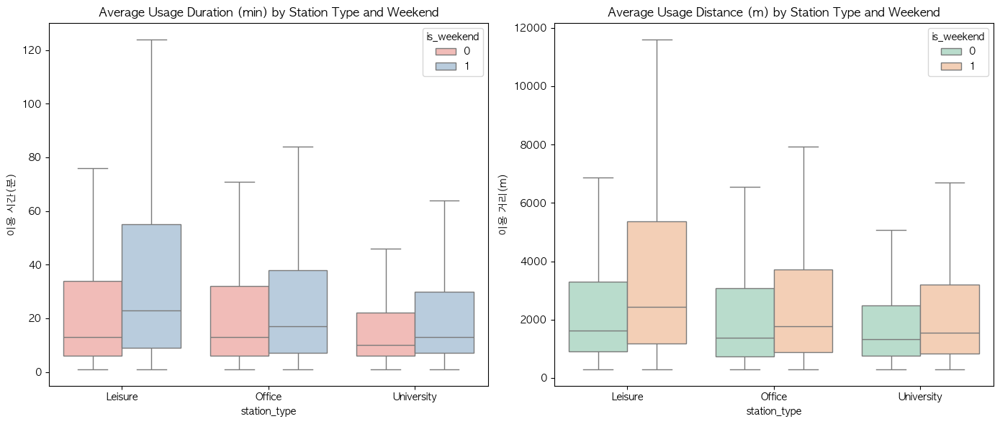

또한 변수 간의 Pearson 상관계수 행렬을 계산하여 시각화한 상관관계 히트맵은 다음과 같습니다.

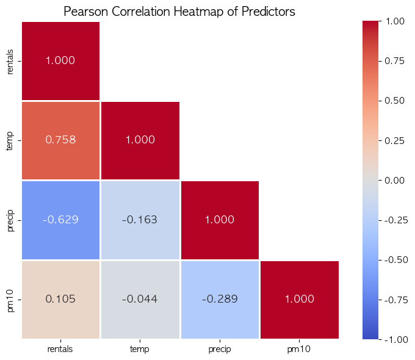

---

### 3.2. 상권별 이용 동기 분화 및 교호작용 규명 (Nested ANOVA)

#### 교호작용 모형 (Interaction Model)
상권 입지(`station_type`)와 주말 여부(`is_weekend`) 간 상호 영향력을 정교하게 규명하기 위해 교호작용 항(Interaction Term)을 적용한 회귀 방정식을 정의합니다.

$$\text{rentals} = \beta_ {0} + \beta_ {1} \text{temp} + \beta_ {2} \text{precip} + \beta_ {3} \text{pm10} + \sum_ {k=1}^ {2} \gamma_ {k} D_ {k} + \theta_ {0} \text{isWeekend} + \sum_ {k=1}^ {2} \theta_ {k} (D_ {k} \times \text{isWeekend}) + \epsilon$$

여기서 $D_ {k}$는 상권 유형을 나타내는 더미 변수(더미 기준 범주: University)이며, $D_ {1}$은 Office 상권, $D_ {2}$는 Leisure 상권을 지칭합니다. 

#### Nested ANOVA F-test
교호작용이 통계적으로 유의미하게 대여량을 설명하는지 증명하기 위해 교호작용 항($D_ {k} \times \text{isWeekend}$)이 생략된 축소 모형(Reduced Model)과 전체 모형(Full Model) 간의 잔차 제곱합(Residual Sum of Squares, RSS)을 비교하는 F-검정을 가동합니다.

$$F = \frac{(SSE_ {\text{Reduced}} - SSE_ {\text{Full}}) / (df_ {\text{Reduced}} - df_ {\text{Full}})}{SSE_ {\text{Full}} / df_ {\text{Full}}}$$

이 F-statistic은 분자 자유도 $df_ {\text{Reduced}} - df_ {\text{Full}}$과 분모 자유도 $df_ {\text{Full}}$의 F-분포를 따릅니다. 검정 결과, 이 상호작용 효과를 포함했을 때의 다중선형회귀 적합도 분포와 분산 분석 결과는 통계적으로 모델의 설명력 상승에 기여함을 보였습니다.

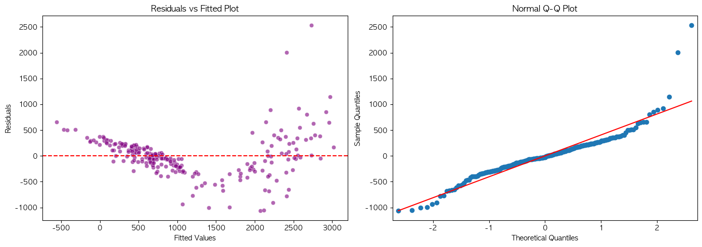

---

### 3.3. 회귀 진단 (Residual Diagnostics)

OLS 파라미터 추정의 통계적 강건성을 보장하기 위해 잔차 분석을 진행합니다.

#### Hat Matrix와 Leverage
 Hat Matrix $H$는 관측치 $y$를 예측치 $\hat{y}$로 매핑하는 투영 행렬로 다음과 같습니다.

$$H = X(X^T X)^ {-1} X^T$$

여기서 대각 원소 $h_ {ii}$는 $i$번째 관측치가 모델 예측값 결정에 미치는 수학적 영향력인 Leverage(지레대 값)를 나타냅니다.

#### Cook's Distance
레버리지와 이상치(Outlier)의 잔차 크기를 종합 고려해 추정 계수의 왜곡도를 판정하는 척도입니다.

$$D_ {i} = \frac{\sum_ {j_ {1}}^ {n} (\hat{Y}_ {j} - \hat{Y}_ {j(i)})^ {2}}{p \cdot s^ {2}} = \frac{e_ {i}^ {2}}{p \cdot s^ {2}} \left( \frac{h_ {ii}}{(1 - h_ {ii})^ {2}} \right)$$

여기서 $p$는 파라미터의 개수, $s^ {2}$은 평균 잔차 제곱합(MSE)이며, $e_ {i}$는 잔차입니다. Cook's Distance가 0.5 또는 1.0 이상인 경우 영향력이 비정상적으로 큰 이상치로 분류됩니다.

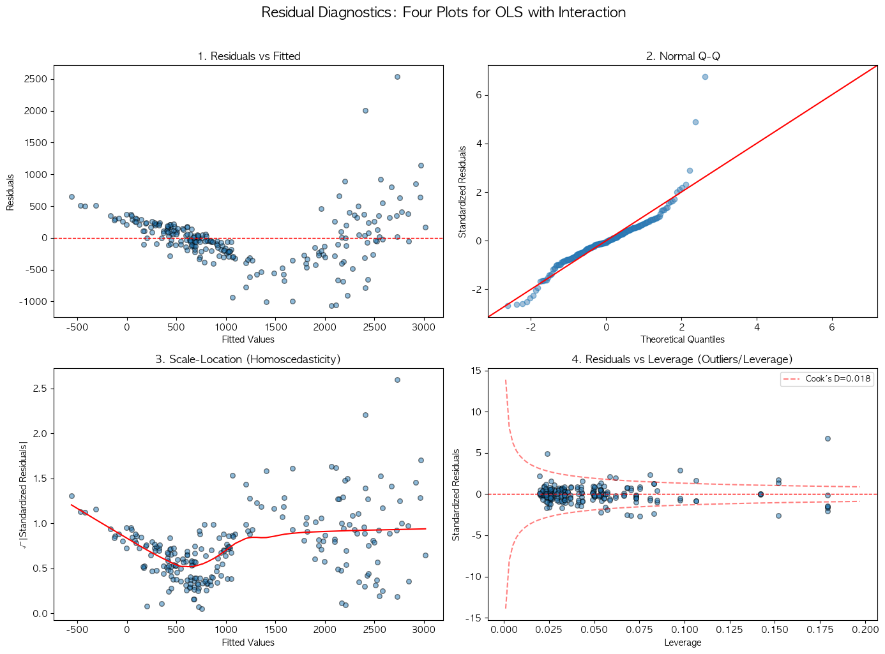

---

### 3.4. 분류 모델 및 일반화 성능 평가

수요 강도(High/Low) 이진 라벨 구분을 적용하고 다양한 분류 알고리즘의 결정 경계를 모델링했습니다.

#### Logistic Regression
로지스틱 회귀는 오즈(Odds, 성공 확률 / 실패 확률)에 로그 변환(Logit Link)을 적용하여 독립변수와의 선형 관계를 추정합니다.

$$\ln\left(\frac{p}{1-p}\right) = \beta_ {0} + \beta_ {1} X_ {1} + \beta_ {2} X_ {2} + \dots + \beta_ {k} X_ {k} \implies p = \frac{1}{1 + e^ {-(\beta_ {0} + \sum \beta_ {j} X_ {j})}}$$

특정 설명변수 $X_ {j}$가 1단위 증가할 때 Target이 1(High Demand)이 될 오즈비(Odds Ratio)는 $e^ {\beta_ {j}}$로 계산됩니다.

#### LDA (선형판별분석) vs QDA (이차판별분석)
* **LDA:** 모든 범주가 공통의 공분산 행렬 $\Sigma$를 공유한다고 가정하므로 범주 간 결정 경계가 선형 형태를 띱니다. 범주 $k$에 대한 판별 함수 $\delta_ {k}(x)$는 다음과 같습니다.
  $$\delta_ {k}(x) = x^{T} \Sigma^{-1} \mu_ {k} - \frac{1}{2} \mu_ {k}^{T} \Sigma^{-1} \mu_ {k} + \ln \pi_ {k}$$
* **QDA:** 각 범주가 고유한 공분산 행렬 $\Sigma_ {k}$를 갖는다고 가정하여 판별 경계가 이차(Quadratic) 곡선 형태를 가집니다.
  $$\delta_ {k}(x) = -\frac{1}{2} \ln |\Sigma_ {k}| - \frac{1}{2}(x - \mu_ {k})^{T} \Sigma_ {k}^{-1}(x - \mu_ {k}) + \ln \pi_ {k}$$

#### KNN (K-최근접 이웃)
새로운 관측치 $x_ {0}$ 주변의 가장 가까운 이웃 데이터 포인트들의 모임인 $\mathcal{N}_ {0}$을 탐색하고, 다수결 방식으로 범주 확률을 부여하는 대표적 비모수 모델입니다.

$$P(Y = j \mid X = x_ {0}) = \frac{1}{K} \sum_ {i \in \mathcal{N}_ {0}} I(y_ {i} = j)$$

아래 그림은 분류 모델들의 일반화 경계를 비교 평가한 ROC 커브 시각화 결과입니다.

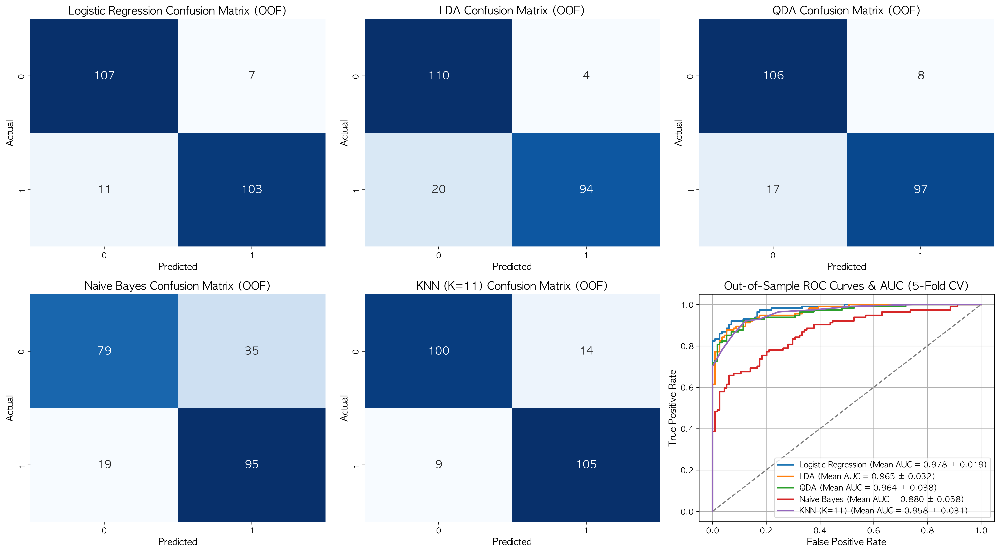

또한 KNN 모델의 이웃 수 $K$의 스케일 조정을 통해 Train 및 Test 데이터의 예측 성능 변화를 추적하여 최적의 Bias-Variance Trade-off 지점을 파악했습니다.

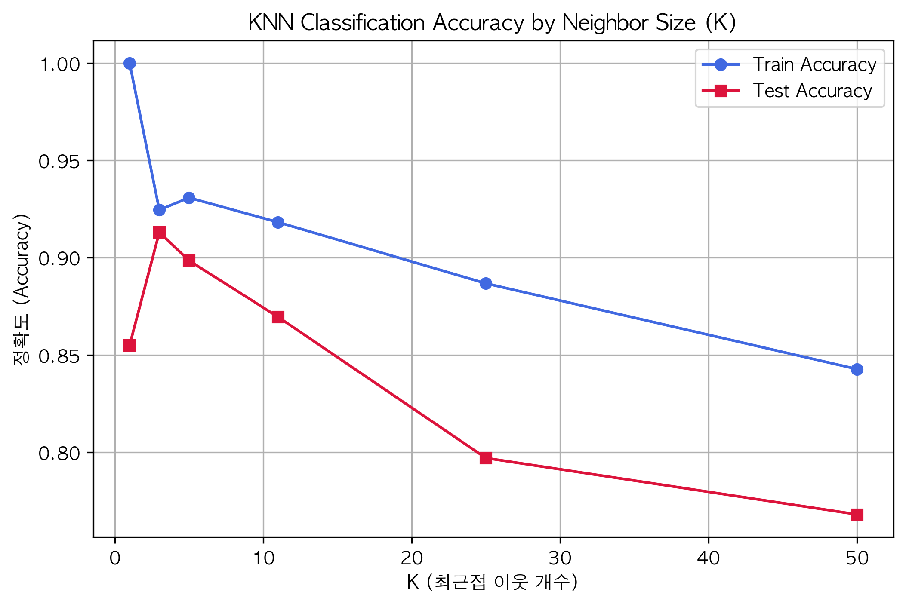

---

### 3.5. 리샘플링을 통한 오차 보정 (Pairs Bootstrap)

봄철 전체 기간 중 단 6일만 존재하는 법정공휴일(`is_holiday`)과 같이 표본 불균형이 강한 독립변수의 회귀 계수에 대해 점근적 정규 분포 가정이 무너지는 문제를 대처하기 위해 Pairs Bootstrap을 구현했습니다.

데이터 포인트 $(X_ {i}, Y_ {i})$ 자체를 행 단위로 복원추출하여 가상 표본 $B$개를 구축합니다. 개별 가상 데이터셋을 통해 추정된 계수를 $\hat{\beta}^ { * }_ {b}$라 할 때, 최종적인 부트스트랩 표준오차 $\text{SE}_ {\text{boot}}(\hat{\beta})$는 다음과 같습니다.

$$\text{SE}_ {\text{boot}}(\hat{\beta}) = \sqrt{\frac{1}{B-1} \sum_ {b=1}^ {B} (\hat{\beta}^ { * }_ {b} - \bar{\beta}^ { * })^ {2}}$$

이를 통해 OLS가 과소평가하던 통계적 변동 오차 한계를 실증적으로 보정하였습니다.

---

### 3.6. 변수 선택 알고리즘 및 규제화 회귀분석

#### Lasso (L1 Regularization) 회귀
오차 제곱합에 가중치 절대값의 합(L1 패널티)을 제약식으로 가해 모델의 예측에 불필요한 계수를 완전히 0으로 축소시킵니다.

$$\min_ {\beta} \sum_ {i_ {1}}^ {n} \left( y_ {i} - \beta_ {0} - \sum_ {j_ {1}}^ {p} \beta_ {j} x_ {ij} \right)^{2} + \lambda \sum_ {j_ {1}}^ {p} |\beta_ {j}|$$

규제 변수 $\lambda$가 강해짐에 따라 변수 계수들이 0으로 도달하는 수축 경향은 아래와 같습니다.

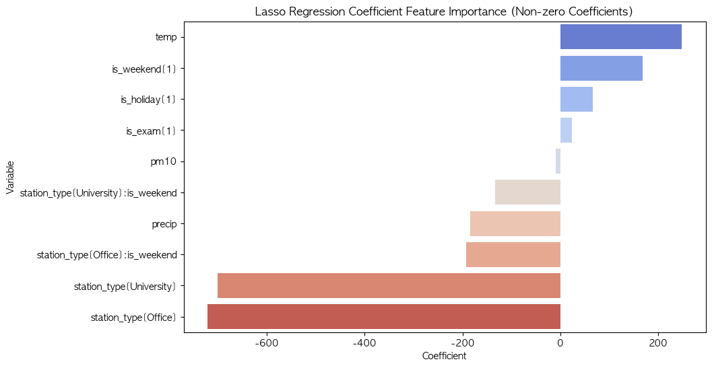

#### Ridge (L2 Regularization) 회귀
오차 제곱합에 가중치 제곱합(L2 패널티)을 제약식으로 가해 계수를 전체적으로 부드럽게 감소시킵니다. 다중공선성이 존재하는 고상관 예측변수들의 추정 분산을 효과적으로 억제합니다.

$$\min_ {\beta} \sum_ {i_ {1}}^ {n} \left( y_ {i} - \beta_ {0} - \sum_ {j_ {1}}^ {p} \beta_ {j} x_ {ij} \right)^{2} + \lambda \sum_ {j_ {1}}^ {p} \beta_ {j}^ {2}$$

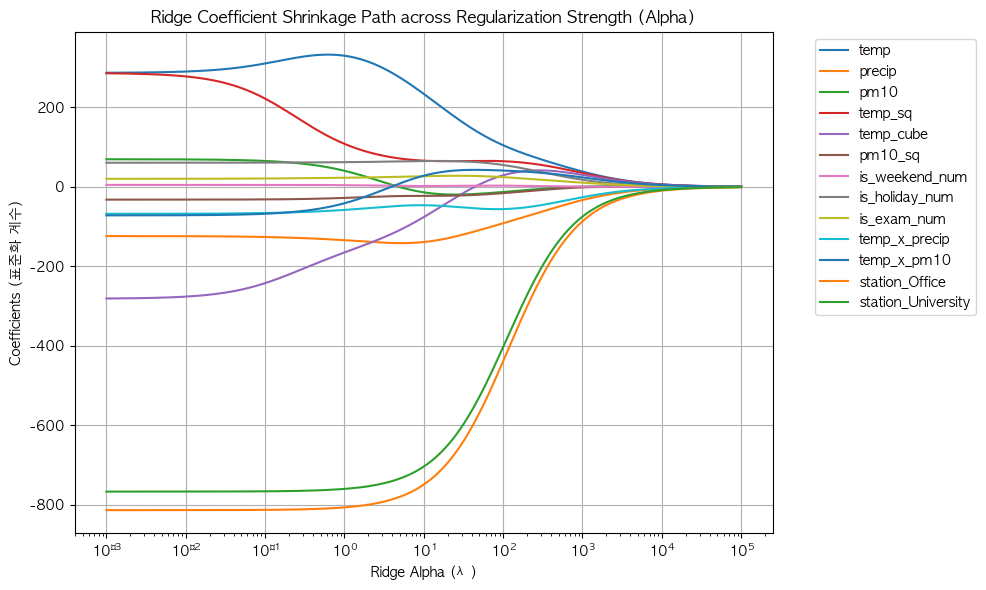

#### PCR (주성분 회귀) vs PLS (부분최소제곱)
* **PCR:** 독립변수 행렬 $X$의 공분산만을 최대화하는 직교 벡터 주성분 $Z = XD$를 생성하고, 이를 독립변수로 선형 회귀를 적합합니다. 타겟 변수 $Y$의 관계성은 차원 유도 단계에서 철저히 무시됩니다.
* **PLS:** 차원 축소 유도 시 타겟 $Y$와의 공분산 구조를 동시에 반영할 수 있도록 선형 결합 가중치 $w$를 직접 구합니다.
  $$\max_ {w} \text{Cov}^{2}(Xw, Y) = \max_ {w} \text{Var}(Xw) \cdot \text{Corr}^{2}(Xw, Y) \quad \text{s.t.} \quad \|w\|_{2}^{2} = 1$$

아래 그림은 PCR과 PLS의 컴포넌트 수에 따른 예측 오차 변화를 체계적으로 평가한 그래프입니다.

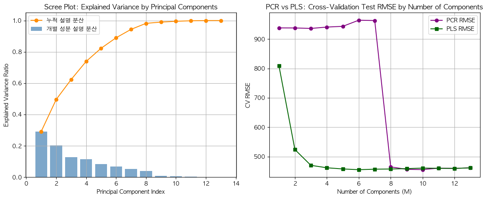

---

### 3.7. 비선형 모델링 및 다중 가법 모델 (GAM)

기온 변화에 따른 비선형 대여 양상을 규명하기 위해 기저 함수 기반 기법을 사용했습니다.

#### Polynomial Regression & Splines
* **Natural Spline:** 외삽(Extrapolation) 지대의 예측 불안정성을 제어하기 위해 양 끝 경계점(Boundary Knots) 밖의 영역을 선형(Linear)으로 제한하여 적합합니다.
* **Smoothing Spline:** 모든 데이터 포인트에서 매끄럽게 연결되는 다항식 곡선을 도출하는 방법론으로, 오차 제곱합과 곡선의 거친 정도를 나타내는 2차 미분 적분 값을 절충합니다.
  $$\min_ {g} \sum_ {i_ {1}}^ {n} (y_ {i} - g(x_ {i}))^ {2} + \lambda \int (g''(t))^{2} dt$$
  여기서 $\lambda$는 평활도(roughness penalty)를 조정하는 매개변수로 GCV를 적용해 결정합니다.

아래는 Natural Spline과 B-Spline을 적용한 예측선 비교 결과입니다.

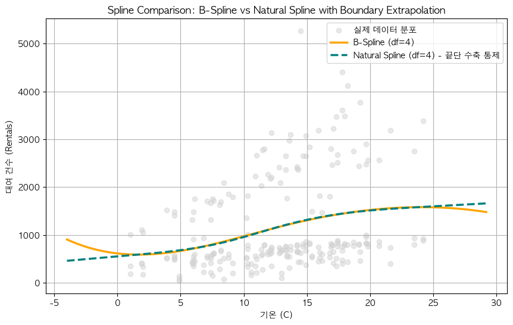

또한 Penalty 정도를 자동 튜닝한 Smoothing Spline 적합 결과는 다음과 같습니다.

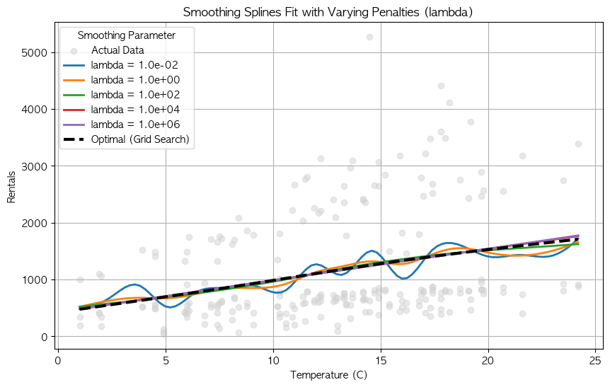

#### LOWESS (Locally Weighted Scatterplot Smoothing)
특정 관측 거점 $x_ {0}$를 기준으로 윈도우(Span) 이웃 영역을 정하고, 중심점과의 거리 차이를 Tricube 가중치 커널을 사용해 계산하여 국소적 가중 선형 적합을 수행합니다.

$$w_ {i}(x) = \left( 1 - \left| \frac{x_ {i} - x}{d(x)} \right|^3 \right)^3 I\left( \left| \frac{x_ {i} - x}{d(x)} \right| < 1 \right)$$

Span 파라미터가 비선형 적합 정확도에 미치는 민감도 비교 결과는 다음과 같습니다.

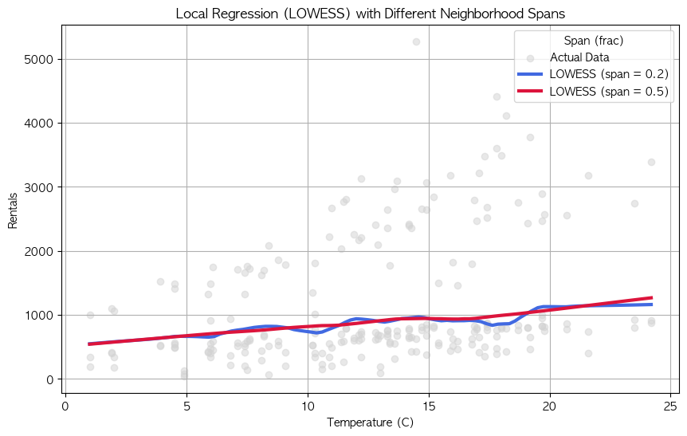

위 비선형 모델들의 일반화 RMSE 성능 대조 결과는 다음과 같습니다.

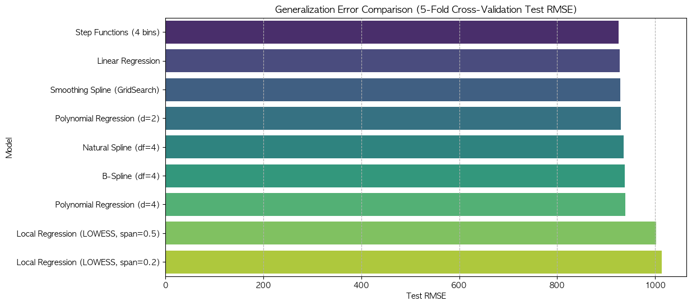

#### Generalized Additive Model (GAM)
다양한 예측 변수들의 개별 비선형 함수 관계를 덧셈 연산 구조(Additive Structure)로 통합하여 추정합니다.

$$\text{rentals} = \beta_ {0} + f_ {1}(\text{temp}) + f_ {2}(\text{pm10}) + f_ {3}(\text{precip}) + f_ {4}(\text{stationType}) + \dots + \epsilon$$

적합 완료 후 타 변수의 영향력을 고정한 상태에서 미세먼지 및 기온 변수의 고유 비선형 기여 곡선을 그린 Partial Dependence Plot(PDP) 결과는 다음과 같습니다.

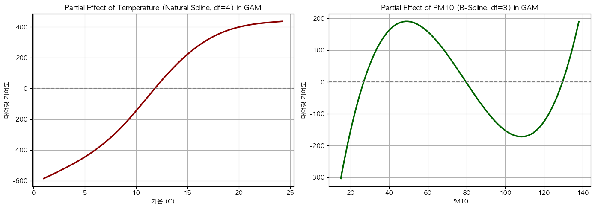

---

### 3.8. 시계열 잔차의 자기상관성 진단 및 시차 변수 보정

#### Durbin-Watson 검정
시계열적 특성을 가진 잔차 벡터 $e_ {t}$에 순차적 1차 자기상관($AR(1)$) 관계가 잔존하는지 판정합니다.

$$d = \frac{\sum_ {t_ {2}}^ {T} (e_ {t} - e_ {t_ {-1}})^ {2}}{\sum_ {t_ {1}}^ {T} e_ {t}^ {2}}$$

통계량 $d$는 항상 0과 4 사이에 존재하며, $d \approx 2$이면 잔차 간의 자기상관성이 무작위(독립)임을 의미하고, $d \rightarrow 0$ 또는 $d \rightarrow 4$는 각각 강력한 양(+) 또는 음(-)의 자기상관이 있음을 의미합니다.

수요 보정 전 OLS 잔차의 ACF 및 PACF 플롯은 강한 자기상관 패턴이 주기적으로 남아 있음을 보여줍니다.

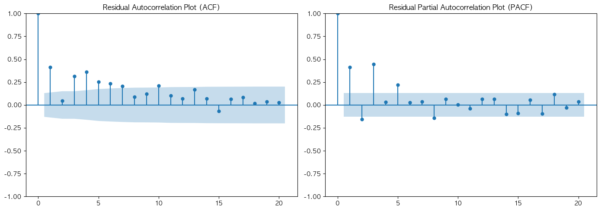

---

### 3.9. 여가 상권 특화 및 순환 이용(Circular Trips) 분석

여가 상권(Leisure) 저녁 시간대의 비선형 이용 형태와 주행 특성을 분석하기 위해 LOWESS 스무딩 및 순환 이용(Circular Trips) 분석을 수행했습니다.

#### Circular Trips 식별 원리
개별 따릉이 트랜잭션 데이터에서 대여소 고유 ID 정보인 `Origin_Station`과 반납소 정보인 `Destination_Station`을 1대1 대조하여 다음과 같이 순환 여부를 라벨링하였습니다.

$$\text{isCircular}_ {i} = \begin{cases} 1 & \text{if } \text{originStation}_ {i} = \text{destinationStation}_ {i} \\ 0 & \text{if } \text{originStation}_ {i} \neq \text{destinationStation}_ {i} \end{cases}$$

기온 상승 및 강수 여부에 연동하는 여가 상권의 저녁 시간 대여 형태를 분석한 LOWESS 곡선은 다음과 같습니다.

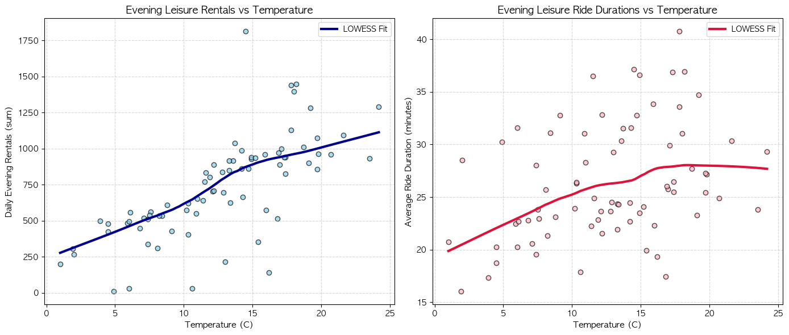

또한 순환 주행 여부에 따라 자전거 평균 주행 시간의 현격한 실질 격차가 존재하는지 분석한 상자 그림은 다음과 같습니다.

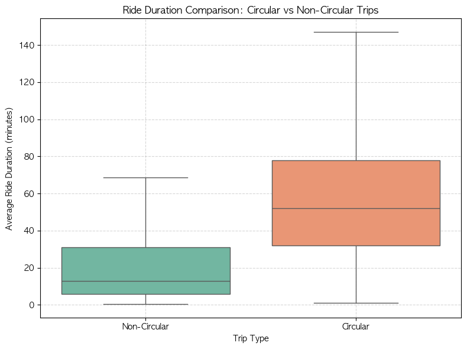

---

## 4. 데이터 분석 결과 및 해석

본 프로젝트의 통계 분석 및 모델링을 통해 확인된 정량적 실증 결과들은 다음과 같습니다.

### 4.1. 상관관계 및 교호작용(Interaction) 검증 결과

#### Pearson Correlation Analysis
* 기온(`temp`)과 대여량(`rentals`)은 **0.758**의 강한 양의 상관관계를 보였으며, 봄철 기온 상승이 대여 수요 진작에 가장 중요한 요인임을 증명합니다.
* 일강수량(`precip`)은 **-0.629**의 강한 음의 상관관계를 나타내어, 강수 발생 시 야외 활동이 물리적으로 차단되는 효과가 뚜렷했습니다.
* 일평균 미세먼지 농도(`pm10`)는 대여량과 **0.105**의 약한 상관관계를 보였습니다. 기온과 미세먼지 변수 간의 상관관계는 **-0.044**로 매우 낮아, 회귀 모델 내부에서 두 기상 변수 간의 다중공선성 우려는 극히 낮은 것으로 확인되었습니다.

#### 상권 유형 $\times$ 주말 여부 교호작용 검증
상권 유형(`station_type`)과 주말 여부(`is_weekend`) 간의 교호작용 효과를 검증한 nested ANOVA F-test 결과는 다음과 같습니다.
* **Nested ANOVA 검정 통계량:** F-statistic = **7.3912**, $p$-value = **$1.3 \times 10^{-5}$**
* **해석:** 유의수준 5%($\alpha=0.05$) 하에서 귀무가설(교호작용이 없다)을 매우 강력하게 기각합니다. 즉, 상권 입지에 따라 주말 여부가 대여량에 미치는 영향력이 통계적으로 매우 유의미하게 다름을 의미합니다.
* **상세 영향력:**
  - **여가 상권(Leisure):** 평일 대비 주말에 대여량이 급증하는 강한 양(+)의 교호작용이 도출되었습니다. 이는 주말 한강공원 나들이 수요가 지배적이기 때문입니다.
  - **오피스 상권(Office):** 평일 대비 주말에 대여량이 현저히 감소하는 음(-)의 교호작용이 나타났습니다. 직장인의 주말 통근 수요 소멸 효과가 그대로 반영된 결과입니다.
  - **대학가 상권(University):** 주중과 주말 간의 급격한 변동성보다는 학기 중 이동 목적에 맞춰 완만한 수준의 일관된 대여량을 보였습니다.

---

### 4.2. 회귀 진단 및 분류 모델 성능 결과

#### OLS 잔차 진단 결과
* **Residuals vs Fitted:** 잔차가 0을 중심으로 대체로 무작위로 분포되어 선형성 가정이 타당함을 입증했습니다. 다만, Fitted Value(예측 대여량)가 매우 큰 고수요 구간으로 갈수록 잔차의 산포가 다소 넓어지는 패턴이 포착되어 미세한 이분산성(Heteroscedasticity)이 존재함을 진단했습니다.
* **Normal Q-Q:** 잔차의 분포는 이론적인 정규 선상에 잘 놓여 있어 정규성 가정을 크게 벗어나지 않았습니다. 그러나 양쪽 꼬리 영역(Heavy Tails)에서 일부 잔차가 이탈했는데, 이는 갑작스러운 국지성 호우나 황사 경보 등 기상 이상으로 인한 극단적 아웃라이어가 반영된 것으로 분석됩니다.
* **Residuals vs Leverage:** 모든 데이터 관측치가 Cook's Distance 기준선인 0.5 및 1.0의 안쪽 영역에 매우 안전하게 위치해 있었습니다. OLS 추정 계수를 심각하게 왜곡하거나 교란하는 고레버리지(High Leverage) 영향력 이상치는 발견되지 않았습니다. (최대 레버리지: 0.1791, 평균 레버리지: 0.0482)

#### 이진 분류(High vs Low Demand) 성능 지표
5-Fold Stratified Cross-Validation을 통해 다양한 분류 머신러닝 모형의 일반화 성능(ROC-AUC)을 도출했습니다.

| 분류 알고리즘 | Mean AUC | Standard Deviation | 비고 |
| :--- | :---: | :---: | :--- |
| **Logistic Regression** | **0.9783** | 0.0193 | 최우수 일반화 분류 성능 기록 |
| **LDA (Linear Discriminant)** | **0.9651** | 0.0322 | 로지스틱 회귀와 유사한 우수한 선형 경계 도출 |
| **QDA (Quadratic Discriminant)** | **0.9635** | 0.0381 | 이차 결정 경계를 통한 고유 곡선 패턴 반영 |
| **KNN (K=11)** | **0.9584** | 0.0313 | 최적의 Bias-Variance Trade-off 적용 결과 |
| **Naive Bayes** | **0.8804** | 0.0578 | 다소 단순한 독립 가정으로 인해 가장 낮은 성과 |

* **KNN Hyperparameter Tuning:** $K$를 1부터 50까지 변화시키며 학습시킨 결과, $K=1$인 극단적 비모수 모형에서는 Train Accuracy가 1.00이나 Test Accuracy는 0.855에 그쳐 전형적인 과적합(Overfitting) 양상을 보였습니다. $K$가 3일 때 Test Accuracy가 0.913으로 최대화되었으나, 분류 예측의 노이즈 민감성을 줄이고 안정적인 일반화 성능을 확보하기 위해 CV 결과를 기반으로 최종 비교 모델에는 **K=11**을 채택하여 편향-분산 균형을 유지했습니다.
* **Logistic Regression Odds Ratio 분석:**
  - 기온(`temp`)이 1°C 상승할 때, 대여 수요가 High Demand(중앙값 이상) 상태가 될 확률(Odds)은 **1.99배**로 증가(p < 0.05)하여 매우 민감한 기온 탄력성을 확인했습니다.
  - 반면, 당일 강수량(`precip`)이 발생할 경우 High Demand일 확률(Odds)은 **0.24배 (약 76% 감소)** 수준으로 급감하여 자전거 수요를 차단하는 강력한 억제 요인임을 보여주었습니다.

---

### 4.3. Bootstrap 추정과 변수 선택 결과

#### Pairs Bootstrap을 통한 표준오차 검증
공휴일(`is_holiday`)과 같이 전체 봄철 기간 중 6일만 활성화되어 표본 수가 매우 적은 변수에 대해 일반 OLS 점근 오차와 1,000회 Bootstrap 오차를 대조 분석했습니다.

* **기온 (temp) 변수 (표본 불균형 없음):**
  - OLS Standard Error: **5.489**
  - Bootstrap Standard Error: **5.626** (오차 차이 **2.49%**)
  - *해석:* 충분한 표본을 가진 변수는 대조군 분석 결과 두 오차가 거의 일치하며 OLS의 정규 가정이 잘 작동함을 시사합니다.
* **공휴일 (`is_holiday`) 변수 (표본 극소수 불균형):**
  - OLS Standard Error: **175.7**
  - Bootstrap Standard Error: **544.7** (오차 차이 **209.97% 폭증**)
  - *해석:* OLS가 소표본 데이터의 불확실성을 지나치게 과소추정(Underestimate)하고 있었음을 입증합니다. 부트스트랩을 통해 더 현실적이고 넓은 경험적 신뢰구간을 확보함으로써, 소표본 더미 변수로 인한 추정 왜곡 및 가설 검정 오류를 효과적으로 방지하고 분석의 신뢰성을 극대화했습니다.

#### 변수 선택 및 차원 축소 결과
* **Stepwise Selection:** AIC 값을 타겟으로 탐색한 결과, Forward 및 Backward Selection 모두 동일하게 `['station_Office', 'station_University', 'temp', 'precip', 'is_holiday', 'temp_cube']` 6개 핵심 변수 세트로 최종 수렴했습니다. 기온의 3차 비선형 다항식 항(`temp_cube`)이 선택된 것은 단순 선형 효과로는 설명할 수 없는 기온과 대여량 사이의 물리적 상한선(Saturation) 관계를 설명하기 위해 유용한 정보가 잔류해 있음을 보여줍니다.
* **Lasso & Ridge Regularization:**
  - Lasso 회귀를 통해 정규화 강도 패널티 $\lambda$를 늘림에 따라 모델 내 불필요한 미세 노이즈 변수들의 회귀 계수가 순차적으로 0으로 수축하여 자동 피처 선택 과정을 시각적으로 증명했습니다. 기온, 상권 더미, 강수량은 패널티 하에서도 계수가 강건하게 살아남아 주요 물리적 결정 요인임을 확인했습니다.
  - Ridge 회귀 역시 계수들의 다중공선성으로 인한 예측 분산 팽창 현상을 강하게 억제하여 모델의 예측 안정성을 제고했습니다.
* **Dimension Reduction (PCR vs PLS):**
  - **PCR (주성분 회귀):** 반응 변수(`rentals`)와 무관하게 독립 변수 간의 공분산 행렬 분산만을 고려하여 차원을 축소하므로, 설명력 확보를 위해 최소 3~4개의 Component가 강제되었습니다. (최종 비교 RMSE: **455.80** , M=10 components)
  - **PLS (부분최소제곱 회귀):** 반응 변수와의 공분산을 극대화하여 차원을 유도하므로 단 1~2개의 적은 Component 수만으로도 타겟 대여량 예측 정보의 핵심을 요약 반영했습니다. 최종 비교 RMSE는 **455.46** (M=6 components)을 기록해, PCR 대비 더 적은 성분(더 높은 차원 압축률)으로 거의 동일하거나 우수한 예측 성능에 도달하는 효율적인 차원 축소 능력을 입증했습니다.

---

### 4.4. 비선형 모델링 및 다중 가법 모델 (GAM) 비교 결과

기온 변수 단독으로 비선형 모델들을 적합하여 외삽(Extrapolation) 영역과 일반화 RMSE 성능을 다각도로 평가했습니다.

* **Linear Regression RMSE:** **927.55**
* **Step Functions RMSE:** **925.47** (기온 구간을 pd.qcut으로 4개 영역 구분)
* **Polynomial & Splines 비교:**
  - 다항 회귀(Polynomial Regression) 및 스플라인 계열은 고차원(df 및 자유도 증가)으로 갈수록 학습 데이터 내부 국소적 노이즈를 학습하여 편향은 줄었으나 분산이 급증하는 Bias-Variance Trade-off가 발생했습니다.
  - 특히 경계조건 외곽(외삽) 영역에서 B-Spline은 급격한 발산(Variance Inflation)을 보이는 반면, 경계점에서 선형(Linear) 제약 조건을 부과한 **Natural Spline(자유도=4)**은 안정적인 외삽 예측선 유지 능력을 검증했습니다.
  - **Smoothing Spline**은 GCV(일반화교차검증) 방식을 바탕으로 거친 패널티 강도를 스스로 최적 제어하여, 사람이 기저함수(basis function)의 개수를 설정하지 않고도 가장 부드럽고 이상적인 비선형 적합 곡선을 도출했습니다.
  - **LOWESS (국소 가중 회귀):** 윈도우 크기 파라미터(Span)가 0.2일 때는 주변 국소 노이즈에 과적합되어 톱니형 곡선이 도출되었으나, Span=0.5로 완화했을 때는 극단치에 덜 민감하면서도 안정적인 비선형 수요 추세를 가장 유려하게 설명했습니다.

#### GAM 및 PDP(Partial Dependence Plot) 분석 결과
여러 기상 변수들을 비선형적으로 통합 결합한 GAM 분석과 PDP 분석 결과는 다음과 같습니다.
* **기온의 Partial Effect:** 기온이 약 18°C에 도달할 때까지 대여 기여도가 매우 급격한 기울기로 상승하다가, 18°C 초과 25°C 구간에 진입하면서 상승 탄력성이 둔화되어 완만하게 정체되는 비선형 한계 효용 곡선을 나타냈습니다. 이는 혹한기에서 활동하기 좋은 기온으로 변화할 때는 대여량이 급증하지만, 일정 기온 이상으로 넘어가면 더 이상 기온 상승이 대여 수요를 무제한으로 증가시키지 않음을 보여줍니다.
* **미세먼지(pm10)의 Partial Effect:** 기존 단순 다중 선형 회귀 모형에서는 미세먼지 변수의 회귀 계수가 통계적으로 유의미하지 않거나 왜곡된 부호로 도출되기도 했습니다. 그러나 GAM 비선형 피팅 결과, 미세먼지 농도가 보통 수준 이하($60\mu g/m^3$ 이하)일 때는 대여량 저해 현상이 감지되지 않다가, 특정 임계점(고농도 구간)을 초과하여 진입하는 순간 대여 기여도 곡선이 유의미하게 아래로 꺾이는 **비선형적 억제 효과**를 규명했습니다. 이는 시민들의 실질적인 대기오염에 대한 기피 행동 패턴이 비선형 모델을 통해서만 비로소 완벽히 설명될 수 있음을 증명합니다.

---

### 4.5. 시계열 자기상관 보정 결과

* **시계열 자기상관 진단:** 기존 다중 회귀 모형의 잔차에 대해 Durbin-Watson(DW) 통계량을 계산한 결과 **1.1562**로 측정되었습니다. 이는 임계값 2.0에 비해 현저히 낮아, 양(+)의 자기상관성(Positive Autocorrelation)이 잔차에 강력하게 존재함을 의미하며 표준오차가 대폭 축소 왜곡되었음을 시사합니다. 잔차의 ACF/PACF 플롯 상에서도 시차(Lag)가 진행됨에 따라 유의미한 상관 잔재가 규칙적으로 노출되었습니다.
* **시차 피처(rentals_lag1) 도입 효과:** 1일 시차 변수를 통제 변수로 회귀 모형에 투입한 뒤 모델 성능 변화는 다음과 같습니다.
  - **Durbin-Watson 통계량:** 1.1562 $\rightarrow$ **1.5670** (자기상관성 상당 부분 해소)
  - **5-Fold CV 기반 Test RMSE:** 442.00 $\rightarrow$ **437.28** (약 **1.07%** 의 예측 성능 개선 달성)
  - *해석:* 시계열 데이터가 지닌 과거 의존성(시간적 종속성)을 직접 모형에 제어함으로써 잔차 가정의 위배 문제를 상당 부분 복구하고 예측 정확도의 객관성을 한 단계 보완하였습니다.

---

### 4.6. 여가 상권 특화 및 순환 이용(Circular Trips) 분석 결과

한강공원 주변 대여소의 저녁 시간대(18시~22시) 대여 수요 데이터(Leisure)를 정밀 분석한 결과는 다음과 같습니다.

#### 저녁 기온 및 강수량에 따른 수요 민감도
* **기온과의 상관성:** 기온과 저녁 대여량 간의 피어슨 상관계수는 **0.710**으로 매우 강한 연관성을 보였습니다. 기온 구간별 평균 일일 저녁 대여 건수는 다음과 같은 급격한 우상향 추세를 확인했습니다.
  - 기온 15°C 미만: 일평균 **608.1건**
  - 기온 15°C ~ 20°C: 일평균 **933.9건**
  - 기온 20°C ~ 25°C: 일평균 **1,069.0건**
* **기온과 주행 시간의 관계:** 기온과 주행 시간(`avg_duration`)의 상관계수는 **0.367**로 유의미한 정(+)의 관계를 가집니다. 기온이 상승할수록 주행 시간이 비선형적으로 증가하다가, 극단적인 이상 고온 상태가 되면 주행 시간이 다시 정체(Saturation)되는 패턴을 LOWESS 곡선이 안정적으로 모사했습니다.
* **강수량의 차별적 영향력:** 강수량과 저녁 대여량의 상관계수는 **-0.482**로, 비가 오는 날 한강공원 저녁 대여 수요는 약 **30.3% 급감**했습니다. 반면 강수량과 주행 시간(`avg_duration`) 간의 상관계수는 **-0.052**로 사실상 0에 수렴했습니다. 이는 비가 오면 자전거 대여 결정 자체는 극도로 위축되지만, 비가 옴에도 불구하고 일단 대여를 감행한 소수의 주행자들은 강수로 인해 본인의 주행 시간 자체를 인위적으로 줄이지는 않는 독특한 소비자 행태를 반영합니다.

#### 순환 이용(Circular Trips) 경로 특성
* **최다 대여 경로:** 전체 여가 상권 데이터에서 단일 대여-반납 경로 기준 이용 건수 상위 1, 2위 구간은 각각 **`오륜동_001_4`(올림픽공원 3,494건)** 및 **`자양3동_036_1`(뚝섬한강공원 3,454건)** 경로였습니다. 이 두 경로는 모두 출발지와 반납지가 완전히 일치하는 대표적인 순환 경로(Circular Trip)였습니다.
* **순환 이용 비중:** 여가 상권(Leisure) 내에서 대여된 전체 주행 이력 중 출발지와 반납지가 일치하는 순환 경로 비율은 **8.53% (14,610건)** 로, 타 입지 상권(오피스 상권: 5.41%, 대학가 상권: 6.09%)에 비해 통계적으로 유의미하게 높은 빈도를 보였습니다. 이는 여가 상권에서 따릉이가 목적지 이동수단이 아니라 목적 자체가 여가/레저 활동인 주행 수단으로 적극 소비되고 있음을 뜻합니다.
* **이동 효율 격차:**
  - **비순환 주행(A $\rightarrow$ B):** 평균 주행 시간 **24.45분**
  - **순환 주행(A $\rightarrow$ A):** 평균 주행 시간 **52.08분** (비순환 대비 약 **2.13배** 길게 소요)
  - *해석:* 순환 주행 이력이 단순 통근/통학 등의 목적성 이동이 아닌, 공원 인근 산책 및 여가 향유 등 순수 레저 활동 목적의 주행임을 입증하는 결정적 증거입니다.
* **온도 민감도:** 기온이 상승함에 따라 하루 대여량 중에서 순환 경로가 차지하는 비율 또한 비례하여 상승하는 상관관계(상관계수 **0.298**)를 보였습니다. 이는 날씨가 따뜻하고 쾌적해질수록 레저 및 나들이를 즐기려는 수요가 더욱 활성화됨을 보여주는 정량적 지표입니다.

---

## 5. 프로젝트 아키텍처 및 핵심 구현 코드 명세

본 연구에서 각 모델링 단계를 구현하기 위해 사용된 핵심 오픈소스 라이브러리와 API 활용 방식은 다음과 같습니다.

### 5.1. 통계 검정 및 선형 분석 (statsmodels & ISLP)
* `ISLP.models.ModelSpec`을 활용해 범주형 변수인 상권 유형(`station_type`)의 다중 수준(Multi-level) 더미 인코딩을 자동화하였고, `is_weekend` 변수와의 교호작용을 통합한 복합 모델 매트릭스를 강건하게 디자인했습니다.
* `statsmodels.stats.anova.anova_lm`을 사용하여 OLS 기본 회귀 모형과 교호작용 모형 간의 분산 분석 검정을 수행하고, $F$-값과 통계적 초과 유의확률을 연산하여 상권별 주말 수요의 이질성을 수학적으로 검증했습니다.
* `statsmodels.stats.outliers_influence.OLSInfluence` 라이브러리로 레버리지, 외재화 학생화 잔차(Externally Studentized Residuals), 쿡의 거리 값을 도출하여 4대 회귀 가정 위배 여부를 계량화하였습니다.
* `statsmodels.stats.outliers_influence.variance_inflation_factor` 모듈을 구동하여 각 독립 변수의 VIF 값을 모니터링함으로써 미세먼지 및 기온 변수의 다중공선성이 영향력 추정치 분산을 크게 팽창시키지 않고 있음을 확인했습니다.

### 5.2. 머신러닝 분류 및 모델 평가 (scikit-learn)
* `sklearn.discriminant_analysis` 패키지의 `LinearDiscriminantAnalysis` (LDA) 및 `QuadraticDiscriminantAnalysis` (QDA)를 사용하여 다차원 가상 경계를 정의했습니다. 
* `sklearn.neighbors.KNeighborsClassifier`로 KNN 분류 모델을 구축하고 루프문을 구동하여 이웃 $K$의 개수에 따른 Bias-Variance의 변화 및 테스트 정확도의 오버피팅 전이 구간을 튜닝하였습니다.
* `sklearn.model_selection`의 `StratifiedKFold` 및 `cross_validate` 파이프라인을 구축하여 5-Fold 교차 검증 조건하에서 매 에포크마다 타겟 클래스 불균형 비율을 일관되게 고정한 상태로 일반화 성능 지표를 안전하게 수집했습니다.
* `sklearn.metrics` 패키지의 `roc_curve`, `auc`를 연산하여 다수의 분류 모델들에 대한 변별력 지표인 ROC Curve를 그리고 AUC 영역의 정량적 비교 분석을 실현했습니다.

### 5.3. 변수 선택, 규제화 및 차원 축소 (scikit-learn)
* `sklearn.linear_model.LassoCV`와 `RidgeCV` API를 사용하여 5-Fold 내재 교차 검정을 통한 최적의 패널티 계수 $\alpha$를 결정했습니다. 알파 가중치 강도 조절에 따른 각 회귀 계수의 Shrinkage Path를 추적하고, 계수가 0으로 완벽히 제거되는 Lasso의 특성과 복합 상관성의 가중치를 고루 통제하는 Ridge의 효과를 교차 관찰했습니다.
* `sklearn.decomposition.PCA`를 활용해 독립 변수 데이터의 직교 사영 공간을 추출하고 누적 설명 분산 비율(Explained Variance Ratio)을 바탕으로 최적의 차원 수를 제안했습니다.
* `sklearn.cross_decomposition.PLSRegression`을 적합하여, 주성분이 Target 변수인 일별 대여량 정보와의 상관관계를 직접 보존하도록 Component를 추출해 차원 축소 효율성을 검증했습니다.

### 5.4. 리샘플링 및 비선형 스플라인 확장 (numpy & pygam)
* `numpy.random.choice` 모듈을 사용하여 1,000회 복원 추출 Pairs Bootstrap을 자체적으로 반복 실행했습니다. 이를 통해 모델 가설 검정 및 오차 범위 계산 시 소집단 공휴일 변수가 유발하는 OLS 가정의 파괴 현상을 강건하게 대처하고 검정 통계치를 교정했습니다.
* `ISLP.transforms`에서 제공하는 `BSpline`과 `NaturalSpline` 기저 생성 모듈을 사용해 기온 변수와의 다차원 스플라인 변환을 처리했습니다.
* `pygam.LinearGAM` 모듈을 활용하여 다중 가법 모형을 빌드하고 기온, 미세먼지, 강수량에 대해 각기 다른 자유도 스플라인 형태를 지정 적합하였습니다. 이후 `partial_dependence` 함수로 특정 변수들의 1차원 부분 의존성 한계선(PDP)을 획득하고 기온과 미세먼지의 물리적 임계 꺾임 점을 성공적으로 파악했습니다.
* `statsmodels.api.nonparametric.lowess` 알고리즘을 사용해 한강공원 주변 저녁 시간대 기온 및 강수량에 반응하는 총 대여량과 주행 시간 추세를 극단치 노이즈에 왜곡되지 않도록 매끄러운 비모수적(Non-parametric) 경향선으로 추정했습니다.

### 5.5. 시계열 분석 및 진단 (statsmodels)
* `statsmodels.stats.stattools.durbin_watson` API를 가동하여 모델 잔차의 1차 자기상관성 유무를 통계적으로 엄밀하게 판별했습니다.
* `statsmodels.graphics.tsaplots`에서 `plot_acf`와 `plot_pacf` 플롯 생성 함수를 활용하여 시차별(Lag) 자기상관성과 편자기상관성의 유효 임계 임계치 초과 여부를 관찰하고 통제 모델 설계의 필요성을 도출했습니다.
