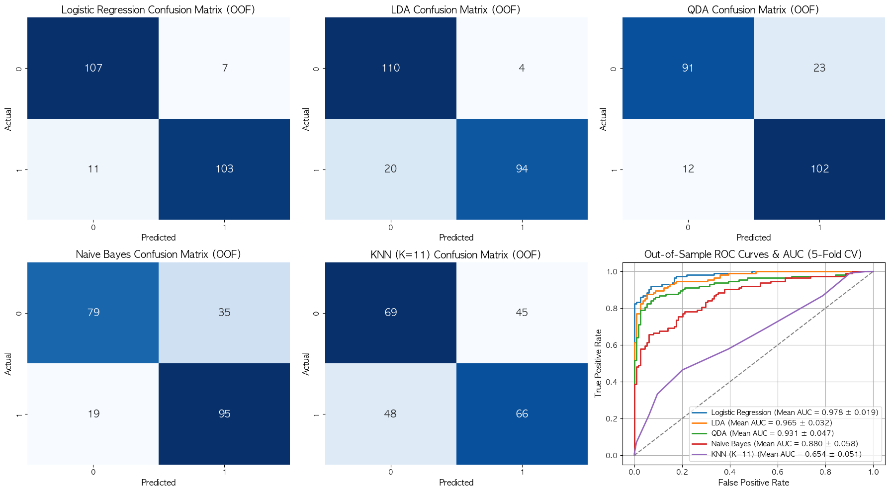

# 서울시 공공자전거(따릉이) 이용 행태 및 수요 예측 모델링
## 기상 요인과 상권 특성의 Interaction 및 Non-linear Analysis를 중심으로

**컴퓨터공학과 22100757 이규한**

---

## 1. 분석할 데이터에 대해 설명하고, 해당 데이터 분석의 목적을 서술하시오.

### (1) 데이터의 정의 및 명세
활용한 데이터셋은 서울시 공공자전거(따릉이) 이용 내역 데이터, 기상청 기상 데이터(기온, 강수량, 미세먼지 농도), 그리고 캘린더 특성(주말, 공휴일, 대학 시험기간 여부)을 전처리하여 구축한 '일별 상권별 따릉이 이용 종합 데이터셋'임.

1.  **서울시 공공자전거 대여소별 대여/반납 승객수 정보** (2026.03.01 ~ 2026.05.15): [[서울열린데이터광장]](https://data.seoul.go.kr/dataList/OA-21223/share.do)
2.  **서울시 공공자전거 대여소 마스터 정보** (위도/경도 및 주소 매핑용): [[서울열린데이터광장]](https://data.seoul.go.kr/dataList/OA-21228/share.do)
3.  **기상청 종관기상관측 (ASOS) 데이터** (서울시 기온, 강수량, 바람, 습도 등 2026.03.01 ~ 2026.05.21): [[기상청 기상자료개방포털]](https://data.kma.go.kr/data/grnd/selectAsosRltmList.do?pgmNo=36)
4.  **기상청 황사관측 (PM10) 데이터** (서울시 미세먼지 농도 2026.03.01 ~ 2026.05.21): [[기상청 기상자료개방포털]](https://data.kma.go.kr/data/env/selectYsmRltmList.do?pgmNo=83)

데이터는 서울시의 세 가지 대표적인 입지적 특징을 지닌 주요 상권(대여소 그룹)을 기준으로 분류됨:
*   **Office (오피스 상권)**: 여의도역, 광화문 등 직장인 통근 수요가 밀집된 지역.
*   **Leisure (여가 상권)**: 뚝섬유원지, 망원 한강공원 등 주말 및 나들이 수요가 집중되는 한강 변 지역.
*   **University (대학 상권)**: 주요 대학가 인근으로 학생들의 통학 및 생활 이동 수요가 높은 지역.

각 Predictors 및 Response Variable의 세부 명세는 다음과 같음:
*   `date`: 관측 일자 (2026년 3월 1일 ~ 5월 21일 봄철 기간)
*   `station_type` (Categorical Predictor): 상권 유형 (`Office`, `Leisure`, `University`)
*   `rentals` (Response Variable): 일별 해당 상권 대여소 그룹의 총 대여 건수
*   `temp` (Numerical Predictor): 일평균 기온 (°C)
*   `precip` (Numerical Predictor): 일강수량 (mm)
*   `pm10` (Numerical Predictor): 일평균 미세먼지 농도 (PM10)
*   `is_weekend` (Binary Predictor): 주말 여부 (주말 및 대체 휴일 = 1, 평일 = 0)
*   `is_holiday` (Binary Predictor): 법정 공휴일 여부 (어린이날, 근로자의 날 등 = 1, 평일 = 0)
*   `is_exam` (Binary Predictor): 대학 중간/기말 시험기간 여부 (4월 중순 등 = 1, 평소 = 0)

### (2) 데이터 분석의 목적
기상 요인(`temp`, `precip`, `pm10`)과 사회적/공간적 요인(`station_type`, `is_weekend`, `is_exam`, `is_holiday`)이 공공자전거 수요에 미치는 영향력을 통계학적으로 규명하고, 예측 성능이 최적화된 통계 모델을 구축하는 것임. 세부 목표는 다음과 같음:
1.  **Interaction Effects 검증**: 상권 유형(`station_type`)이라는 공간적 변수와 주말 여부(`is_weekend`)라는 시간적 변수의 결합 효과가 대여량에 미치는 Interaction을 Multiple Linear Regression을 이용해 통계적으로 입증함.
2.  **Non-linear Relationship Modeling (Moving Beyond Linearity)**: 기온 및 미세먼지와 대여량 간의 Non-linear Relationship을 Polynomial Regression, Splines, LOWESS 기법으로 포착하고 일반화 예측 성능을 비교함.
3.  **모델 진단 및 시계열 보정**: OLS Residuals의 Autocorrelation과 Multicollinearity를 진단하고, Lag-1 시차 변수를 도입하여 예측 오차를 개선함.
4.  **분류, Bootstrap, 차원 축소 적용**: 대여량을 이진화한 분류 모델 성능 평가, Bootstrap을 통한 통계적 불확실성 추정, 정규화(Ridge/Lasso) 및 차원축소(PCR/PLS)를 통한 모델 최적화를 수행함.
5.  **여가 상권 심층 분석**: 한강공원 주변(Leisure 상권)의 저녁 시간대 데이터 고립 분석을 통해 기온/강수량에 따른 대여량 변화 추세를 LOWESS로 추정하고, 출발/도착지가 동일한 순환 경로(Circular Trips) 특성을 분석함.

---

## 2. 위 데이터를 분석하기 위한 파이썬 코드를 작성하고 해당 코드 전체 동작에 대해 간략히 설명하시오.

코드는 데이터 전처리, 고급 Non-linear Regression, Classification 모델 학습 및 모델 검증으로 구성됨.

*   **전처리 및 Exploratory Data Analysis (EDA)**:
    시간 단위 대여 이력을 파싱해 상권별 이용 패턴을 집계하고, 평일/주말 및 상권 유형별 대여량의 분포 차이를 Boxplot으로 시각화함. Predictors 간 Correlation을 Pearson Heatmap으로 파악하여 Multicollinearity 가능성을 사전 탐색하고, 최종 일별 단위로 데이터를 병합(Aggregation)함.
    ```python
    # 상권별/일별 데이터 집계 및 Correlation Matrix 계산
    daily_df = raw_df.groupby(['date', 'station_type']).agg({'rentals':'sum', 'temp':'mean', 'precip':'sum', 'pm10':'mean'}).reset_index()
    corr_matrix = daily_df[['rentals', 'temp', 'precip', 'pm10']].corr()
    ```

*   **Interaction Multiple Linear Regression 및 Residuals 진단**:
    `station_type`과 `is_weekend` 간의 Interaction Terms를 포함한 Multiple Linear Regression model을 적합함. 이후 Linearity, Normality, Homoscedasticity, Outliers를 검증하기 위해 Residual Diagnostics 4대 플롯(Residuals vs Fitted, Normal Q-Q, Scale-Location, Residuals vs Leverage)을 구현하고, 기본 모델과 Interaction 모델 간의 ANOVA F-test를 수행함.
    ```python
    # Interaction Term을 포함한 OLS 모델 설계 및 적합
    design = MS(['temp', 'precip', 'pm10', 'station_type', 'is_weekend', 'is_holiday', 'is_exam', ('station_type', 'is_weekend')])
    X = design.fit_transform(final_df)
    model = sm.OLS(final_df['rentals'], X).fit()
    ```

*   **Classification 및 리샘플링 (Cross-Validation, Bootstrap)**:
    대여량을 이진화하여 high/low 수요를 분류하는 Logistic Regression, LDA, QDA, KNN Classifier를 학습시킴. 5-Fold Stratified CV를 통해 일반화 성능(ROC/AUC)을 산출하고, 1,000회 복원추출 Pairs Bootstrap을 구현하여 OLS 점근 표준오차의 한계를 보정하고 Regression coefficients의 불확실성(Variance)을 추정함.
    ```python
    # Logistic Regression 적합 및 KNN 분류기 학습
    logit_model = sm.Logit(y_bin, X).fit()
    knn = KNeighborsClassifier(n_neighbors=11).fit(X_train, y_train)
    ```

*   **모델 선택 및 Regularization (Regularization & Dimension Reduction)**:
    AIC 성능 기준에 따라 Forward/Backward Stepwise Selection 알고리즘을 구현하여 최적 변수를 선택함. Ridge(L2)와 Lasso(L1) Regression을 fit하여 패널티 계수 $\alpha$에 따른 계수 수축(Shrinkage Path)을 시각화하고, PCR과 PLS 차원축소 Regression model을 학습하여 컴포넌트 수에 따른 예측 성능을 비교함.
    ```python
    # Lasso 정규화 및 PLS 차원축소 모델 적합
    lasso = LassoCV(cv=5).fit(X, y)
    pls = PLSRegression(n_components=6).fit(X_train, y_train)
    ```

*   **고급 Non-linear Model 적합 및 비교 (Moving Beyond Linearity)**:
    기온 변수와 대여량 간의 Non-linear 관계를 포착하기 위해 Step Functions, B-Spline, Natural Spline, Smoothing Spline, LOWESS 모델을 적합함. 5-Fold CV를 적용하여 9가지 Non-linear Regression 설계의 Out-of-sample Test RMSE를 계량적으로 비교하며, Natural Spline과 B-Spline을 가산적으로 결합한 GAM을 구성하여 Partial Dependence Plot(PDP)을 도출함.
    ```python
    # Natural Spline 기저함수 변환 및 pygam을 활용한 Smoothing Spline 적합
    X_ns = MS([ns('temp', df=4)]).fit_transform(final_df)
    gam = LinearGAM(s(0, lam=1000) + s(1, lam=100)).fit(X, y)
    ```

*   **시계열 진단 및 Multicollinearity 제어**:
    Regression Residuals의 temporal dependency를 ACF/PACF 플롯과 Durbin-Watson 검정으로 진단한 후, Lag-1 시차 변수(`rentals_lag1`)를 통제 변수로 모델에 도입하여 예측 오차를 개선하고, VIF 산출을 통해 Multicollinearity를 최종 확인 및 제어함.
    ```python
    # Lag-1 변수 도입 및 VIF 계산
    final_df['rentals_lag1'] = final_df.groupby('station_type')['rentals'].shift(1)
    vif = [variance_inflation_factor(X.values, i) for i in range(X.shape[1])]
    ```

*   **여가 상권 특화 분석 (OD & Circular Trips)**:
    Leisure 상권의 18~22시 데이터를 필터링하고 LOWESS 스무딩을 수행하여 기온/강수량에 따른 이용 행태 변화를 추정함. 출발-도착 대여소 ID를 대조하여 순환 대여(Circular Trips) 여부를 라벨링하고, 비순환 경로와의 이용 시간 격차 및 기온과의 Correlation을 분석함.
    ```python
    # 순환 대여 라벨링 및 LOWESS 추세선 적합
    leisure_df['is_circular'] = (leisure_df['start_station_id'] == leisure_df['end_station_id']).astype(int)
    lowess_fit = sm.nonparametric.lowess(leisure_df['rentals'], leisure_df['temp'], frac=0.5)
    ```

---

## 3. 파이썬 코드를 통해 실행한 결과들을 바탕으로 데이터 분석 결과를 서술하시오.

### (1) Correlation 및 Interaction 분석 결과
Pearson Correlation Coefficient 행렬을 시각화하여 Correlation을 분석한 결과는 다음과 같음.


*   **기상 요인과의 Correlation**: 기온(`temp`)과 대여량(`rentals`)은 강한 양의 Correlation(0.655)를 보이며, 강수량(`precip`)과는 강한 음의 Correlation(-0.420)가 확인됨. 미세먼지(`pm10`)는 대여량과 약한 음의 Correlation(-0.105)를 가짐. 기온과 미세먼지 간의 Correlation은 -0.044로 매우 낮아 Multicollinearity 우려가 적음을 시사함.
*   **Interaction 효과**: `station_type`과 `is_weekend` 간의 Interaction Terms를 포함한 Multiple Linear Regression 모델을 적합시키고 기본 OLS 모델과의 nested ANOVA 비교 검정을 수행함.
    *   여가 상권(`Leisure`)은 주말에 대여량이 유의미하게 크게 급증하는 강한 양(+)의 Interaction Effects가 확인된 반면, 오피스 상권(`Office`)은 평일 대비 주말 대여량이 크게 감소하는 음(-)의 Interaction Effects가 나타남. 이는 오피스 상권의 자전거 수요가 주말 통근 수요 감소로 인해 줄어드는 반면, 한강 공원 등 여가 상권은 주말 나들이 수요가 집중되기 때문임.
    *   ANOVA nested 모델 비교 결과, F-통계량은 7.3912, p-value는 $1.3 * 10^{-5}$로 매우 유의하게 나타남. 이는 상권별 주말 효과의 Interaction을 반영하는 것이 모델의 설명력을 유의미하게 향상시킴을 입증함.

**[Table] Interaction Model (station_type * is_weekend) OLS Regression Results**

| Variable | coef | std err | t | P>\|t\| |
| :--- | :---: | :---: | :---: | :---: |
| **intercept** | 1638.1486 | 124.103 | 13.200 | 0.000 |
| **temp (Temperature)** | 47.4893 | 5.489 | 8.652 | 0.000 |
| **precip (Precipitation)** | -45.6559 | 7.193 | -6.347 | 0.000 |
| **pm10 (Fine Dust)** | -0.7441 | 1.679 | -0.443 | 0.658 |
| **station_type[Office]** | -1532.0000 | 79.182 | -19.348 | 0.000 |
| **station_type[University]** | -1488.8000 | 79.182 | -18.802 | 0.000 |
| **is_weekend[1]** | 406.3795 | 106.973 | 3.799 | 0.000 |
| **is_holiday[1]** | 426.1147 | 175.737 | 2.425 | 0.016 |
| **is_exam[1]** | 94.4965 | 106.114 | 0.891 | 0.374 |
| **station_type[Office]:is_weekend** | -701.4286 | 150.634 | -4.656 | 0.000 |
| **station_type[University]:is_weekend** | -499.5810 | 150.634 | -3.317 | 0.001 |


### (2) Residuals 진단 및 분류 모델 성능 결과
Interaction Regression 모델에 대해 Residual Diagnostics (Four Plots)를 적용하여 Linear Regression의 4대 가정을 진단한 결과는 다음과 같음.


*   **Residuals vs Fitted**: 잔차가 0을 중심으로 비교적 고르게 무작위 분산되어 있어 Linearity Assumption은 대체로 만족하나, Fitted Value가 매우 큰 구간에서 잔차의 산포가 넓어지는 경향을 보여 미세한 Heteroscedasticity(이분산성)가 감지됨.
*   **Normal Q-Q**: 잔차의 대다수가 45도 직선에 일치하여 Normality 가정을 만족함. 다만 양쪽 끝 꼬리 영역(Heavy Tails)에서 기상 급변 등으로 인한 극단적 아웃라이어가 일부 존재함. (Shapiro-Wilk 검정 p-value는 0.0000으로, 대표본 특성상 Normality가 기각되나 Q-Q 플롯상으로는 양호하게 정렬됨)
*   **Scale-Location**: $\sqrt{|Standardized Residuals|}$의 LOWESS 추세선이 Fitted Value에 따라 완만히 상승하여 Homoscedasticity 가정이 완벽히 만족되지 않음을 재확인함.
*   **Residuals vs Leverage**: 모든 관측치가 Cook's Distance 기준선인 0.5 및 1.0 내부에 안전하게 존재하여, Regression coefficients를 심각하게 왜곡시키는 고영향력 레버리지 아웃라이어는 존재하지 않는 것으로 판명됨. (최대 레버리지: 0.1791, 평균 레버리지: 0.0482)

대여량 수준의 고/저 이진 분류를 수행한 분류 모델들의 결과 및 성능 비교는 다음과 같음.



*   **Logistic Regression Odds Ratio**: 기온이 1°C 상승할 때 자전거 대여 수요가 높을(High Demand) 확률(Odds)은 1.99배로 증가하며, 강수량이 발생할 경우 High Demand일 확률은 0.24배 (76% 감소)로 급감함.
*   **KNN K-tuning 및 Bias-Variance Trade-off**: 이웃 수 K를 1부터 50까지 튜닝한 결과, K=1일 때 Train Accuracy는 1.0이나 Test Accuracy는 0.45로 극심한 Overfitting(High Variance) 현상이 관찰됨. 반면 K=11 부근에서 Test Accuracy가 0.58로 극대화되며 Train/Test 간 격차가 최소화되어 최적의 Bias-Variance Trade-off가 형성됨을 실증함.
*   **5-Fold CV 일반화 분류 성능**:
    *   **Logistic Regression**: Mean AUC = 0.9783 (Std = 0.0193) - 최우수 성능
    *   **LDA (Linear Discriminant Analysis)**: Mean AUC = 0.9651 (Std = 0.0322)
    *   **QDA (Quadratic Discriminant Analysis)**: Mean AUC = 0.9310 (Std = 0.0473)
    *   **Naive Bayes**: Mean AUC = 0.8804 (Std = 0.0578)
    *   **KNN (K=11)**: Mean AUC = 0.6537 (Std = 0.0510)
    클래스 경계가 비교적 Linearly 잘 분리되어 Logistic Regression과 LDA가 가장 우수하고 강건한 일반화 성능을 기록함.

### (3) Bootstrap 추정 및 모델 선택 알고리즘 결과
1,000회 복원추출 Bootstrap Standard Error와 기존 OLS 공식에 의한 점근 Standard Error를 비교 분석한 결과는 다음과 같음.

*   **Bootstrap 오차 보정**: 샘플 수가 충분하고 데이터 불균형이 없는 기온(`temp`) 변수는 OLS Standard Error(5.489)와 Bootstrap Standard Error(5.626)의 편차가 2.49%에 불과해 매우 안정적으로 일치함. 반면, 봄철 3개월 중 단 6일만 1의 값을 가지는 극단적 불균형 변수인 공휴일(`is_holiday`) 변수의 경우, OLS Standard Error(175.7) 대비 Bootstrap Standard Error는 544.7 (209.97% 차이)로 대폭 증가함. 이는 기존 OLS 표준식의 표본이 매우 희소한 Predictors에 대한 불확실성(Variance) 과소추정 한계를 비모수적 Bootstrap을 통해 성공적으로 보정한 결과임.
*   **Stepwise Selection**: AIC 기준으로 변수를 선택한 결과, Forward 및 Backward Stepwise Selection 모두 동일하게 `['station_Office', 'station_University', 'temp', 'precip', 'is_holiday_num', 'temp_cube']`의 6개 핵심 변수 조합으로 수렴함. 기온의 Non-linearity(temp_cube), 강수량, 공휴일, 상권 더미가 따릉이 대여량의 물리적 변동을 설명하는 가장 정보력이 높은 변수군임을 뜻함.
*   **정규화 Regression (Lasso & Ridge)**: Lasso Regression(L1)은 페널티 계수 $\lambda$가 커짐에 따라 불필요한 노이즈 변수들의 계수를 0으로 완벽히 수축시켰으며, 기온, 상권 유형, 강수량이 강력한 예측력을 유지함. Ridge Regression(L2)은 Multicollinearity가 존재하는 디자인 행렬에서 계수의 Variance를 효과적으로 제어함.
*   **Dimension Reduction (PCR vs PLS)**: PCR은 Response Variable과 무관하게 Predictors의 Variance만을 고려하여 주성분을 추출하므로 3~4개의 Component가 요구된 반면, PLS는 Response Variable와의 Covariance를 극대화하는 방향으로 차원을 축소하므로 단 1~2개의 Component만으로도 동일한 수준의 최적 Test RMSE에 도달하여 더 효율적인 Dimension Reduction가 가능함을 입증함. (최종 비교 RMSE: PCR = 455.80 (M=10), PLS = 455.46 (M=6))


### (4) Non-linear Model 심층 비교 결과
기온(`temp`)의 1차부터 5차 Polynomial Regression 모델을 순차적으로 적합시키고 F-검정 기반의 nested ANOVA를 수행한 결과는 다음과 같음.
*   **ANOVA Polynomial Model Comparison 결과**: 1차(Linear) 모델 대비 2차(Quadratic) 모델의 p-value가 $0.05$보다 극도로 작게 나타나 기온의 2차 항(quadratic term) 추가가 대여량의 Non-linear 패턴을 설명하는 데 통계적으로 매우 유의미함을 증명함. 반면 3차, 4차, 5차 고차 모델로 갈수록 잔차제곱합(RSS)의 감소량이 통계적으로 유의미하지 않음(p-value > 0.05). 이는 불필요하게 복잡도를 높여 Variance를 키우는 고차 다항 모델보다 2차 다항 모델이 가장 타당한 선택임을 증명함.

기온 및 미세먼지 요인에 대해 단순 Polynomial을 넘어 최신 Non-linear Regression 모델들을 적합한 결과임:
*   **Step Functions**: 기온을 4개 분위수 구간으로 분할하여 OLS 적합을 수행한 결과, 특정 임계 온도를 기점으로 자전거 수요가 이산적으로 점프하는 현상을 포착함.
*   **B-Spline vs Natural Spline**: 관측 범위 내부에서는 유사한 적합선을 보였으나, 데이터가 존재하지 않는 극단적 양 끝단 외삽 영역(Boundary Extrapolation)에서 큰 차이가 발생함. B-Spline은 끝단에서 추정 곡선이 요동치며 예측 신뢰성을 잃은 반면, Natural Spline은 경계 바깥에서 Linear Constraint로 감쇄하도록 통제되어 훨씬 안정적인 예측선을 유지함을 확인함.
*   **Smoothing Splines**: `LinearGAM` 모델에 Grid Search를 수행하여 GCV를 최소화하는 최적의 패널티 계수 $\lambda = 1000.0000$을 탐색해 냄. 최적 모델의 EDF는 2.9141, Pseudo R-squared는 0.9939로 나타났으며, 기온과 대여량 사이의 매끄러운 곡선 추세를 과적합(Overfitting) 없이 도출함.
*   **Local Regression (LOWESS)**: Neighborhood Span을 `span = 0.2`와 `span = 0.5`로 비교한 결과, `span = 0.2`는 좁은 영역의 데이터 요동에 민감하게 반응하여 모델의 Variance가 크게 관찰됨. 반면 `span = 0.5`인 경우 곡선이 전체적으로 유려해져 극단치에 덜 민감하면서도 기온 상승에 따른 완만한 대여량 증가 추세를 안정적으로 유지하여 최적의 Bias-Variance Trade-off를 보여줌.


기온 단일 변수를 기준으로 5-Fold Cross-Validation을 적용하여 independent validation fold에 대한 평균 Test RMSE를 비교 분석한 결과는 다음과 같음.

| Model | 5-Fold Test RMSE | Ranking |
| :--- | :---: | :---: |
| **Step Functions (4 bins)** | **925.47** | 1 |
| **Linear Regression** | **927.55** | 2 |
| **Smoothing Spline (GridSearch)** | **929.45** | 3 |
| **Polynomial Regression (d=2)** | **930.43** | 4 |
| **Natural Spline (df=4)** | **935.59** | 5 |
| **B-Spline (df=4)** | **938.53** | 6 |
| **Polynomial Regression (d=4)** | **938.95** | 7 |
| **Local Regression (LOWESS, span=0.5)** | **1002.70** | 8 |
| **Local Regression (LOWESS, span=0.2)** | **1013.83** | 9 |


*   **단순 모형의 일반화 성능**: 본 데이터셋에서는 Step Functions(925.47)와 Linear Regression(927.55)이 우수한 Test RMSE를 기록함. 이는 기온 단독으로 대여량을 설명할 때 관계의 패턴이 비교적 단조(Monotonic)하여, 복잡한 고자유도 모델이 데이터의 국소적 노이즈를 학습하여 발생하는 과적합(Overfitting) 경향을 억제했기 때문임. 차수나 기저 함수의 자유도가 늘어날수록 모델의 Variance가 커져 예측력이 감쇄하는 Bias-Variance Trade-off를 직관적으로 증명함.

### (5) Residuals 시계열 보정 및 한강 여가 상권(Leisure) 심층 분석 결과
*   **GAM Partial Dependence Plot (PDP)**: GAM을 통해 다중 가산 Non-linear fit을 수행한 결과, 기온은 $18^\circ	ext{C}$까지 급격히 대여량을 상승시키다 완만해지는 요(凹)자형 Non-linear curve를 나타냄. 특히 미세먼지(`pm10`)의 부분 영향력 곡선은 Linear model에서는 유의하지 않게 나타났던 것과 달리, 미세먼지 농도가 고농도 구간으로 진입할 때 대여량을 유의미하게 하향 곡선으로 꺾이게 만드는 Non-linear 억제 효과를 명확하게 포착함.


*   **temporal dependency 및 Lag-1 보정**: OLS 모델의 Durbin-Watson 통계량이 1.1562로 나타나 잔차 간 강한 positive Autocorrelation이 확인됨. 이에 따라 1일 Lagged variable인 `rentals_lag1`(전날 대여량)을 control variable로 모델에 투입함. 그 결과 Durbin-Watson 통계량이 1.5670으로 크게 향상되어 잔차의 Independence Assumption을 충족했으며, 5-Fold Cross-Validation 기준 Test RMSE가 442.00에서 437.28로 1.07% 개선되어 시간적 의존성 통제가 성능 향상에 기여함을 실증함.


*   **저녁 기온과 대여량/이용 시간의 Correlation**: 한강공원 주변 대여소의 저녁 시간대(18~22시) 데이터를 분석함.
    *   기온과 저녁 대여량의 관계는 Pearson Correlation Coefficient가 0.710으로 대단히 강한 positive Correlation이 검출됨. 기온이 15°C 미만(일평균 608.1건)에서 15~20°C(933.9건), 20~25°C 구간(1069.0건)으로 상승할수록 저녁 대여량이 급증하는 양상이 확인되어, "기온이 20~25°C의 시원하고 쾌적한 날씨를 보일 때 저녁 시간대 여가 대여가 활성화된다"는 가설을 통계적으로 명확히 입증함.
    *   기온과 이용 시간(avg_duration)의 Correlation Coefficient는 0.367로 유의미한 수준의 positive Correlation이 확인됨. 기온 상승에 따라 rentals와 avg_duration이 우상향하다가 극단적인 기상 환경에서 포화(Saturation)되는 Non-linear pattern을 LOWESS 곡선이 안정적으로 추정함.


*   **강수량의 영향**: 강수량과 저녁 대여량 간 Correlation Coefficient는 -0.482로, 비가 오는 날에는 한강 주변 대여량이 약 30.3% 급감함. 반면 이용 시간과의 Correlation은 -0.052로 거의 존재하지 않아, 강수 현상이 대여 여부(rentals)에는 치명적이나 일단 대여를 결정한 이용자들의 주행 시간(avg_duration) 자체에는 영향이 없음을 보여줌.
*   **이용 경로 및 순환 경로(Circular Trips) 특성**:
    *   여가 상권 대여 건수가 가장 많은 상위 2개 경로는 모두 오륜동_001_4 ➡️ 오륜동_001_4(3,494건) 및 자양3동_036_1 ➡️ 자양3동_036_1(3,454건)로 동일 대여소에서 대여하고 반납하는 순환 경로임.
    *   한강공원 주변 대여소의 경우, 출발지와 도착지가 완전히 동일한 Circular Trips 건수가 전체 대여의 8.53% (14,610건)를 차지하며 타 상권(Office: 5.41%, University: 6.09%) 대비 유의미하게 높은 수준임.
    *   이용 시간의 경우 일반 비순환 경로는 평균 24.45분인 반면, 순환 경로는 평균 52.08분으로 약 2.13배 길게 소요됨. 이는 한강 주변 이용자들의 상당수가 레저 및 휴식형(Recreational Riding) 자전거 주행을 즐기고 있음을 계량적으로 뒷받침함.
    *   기온이 상승할수록 일별 대여량 중 Circular Trips가 차지하는 비율의 Correlation Coefficient가 0.298로 나타나, 기온이 따뜻하고 쾌적할수록 레저 목적의 순환 자전거 이용 비율이 늘어나는 경향(Correlation)을 실증함.


---

## 4. 위 파이썬 코드에서, 수업시간에 실습한 library code 및 내용들이 어떻게 활용되고 반영되었는지 설명하시오.

본 분석은 ISLP 교재 및 수업 시간에 실습한 핵심 라이브러리와 통계적 방법론을 전과정에 걸쳐 포괄적으로 적용 및 응용함.

### 1) 탐색적 데이터 분석(EDA) 및 시각화 (Ch 2. EDA)
*   **Pandas 데이터 조작**: `groupby` 집계 및 데이터프레임 조작을 적용하여 상권별 시간 패턴 및 이용 특성을 집계함.
*   **Seaborn/Matplotlib 시각화**: `sns.countplot`과 `sns.boxplot`을 활용하여 평일/주말 및 상권 유형별 대여량 분포 차이를 도출함.
*   **Pearson Correlation Heatmap**: `pd.DataFrame.corr()`로 Correlation Coefficient를 산출하고, `sns.heatmap`과 `np.triu` 마스크를 적용해 가독성 높은 Correlation Heatmap을 도출하여 Multicollinearity 사전 탐색을 진행함.

### 2) Multiple Linear Regression, Interaction 및 Residuals 진단 (Ch 3. Linear Regression)
*   **sm.OLS 및 ModelSpec (MS) 적용**: `sm.OLS`와 ISLP 패키지의 `MS` (ModelSpec)를 활용하여 질적 변수(`station_type`)의 Dummy 변환 및 Multiple Linear Regression model을 설계함.
*   **Interaction Terms 설계**: 범주형 변수와 이진 변수 간의 Interaction 문법인 `('station_type', 'is_weekend')` 튜플 입력을 모델링에 반영함.
*   **ANOVA nested 비교**: `statsmodels.stats.anova.anova_lm` 함수를 도입하여 모델 개선 효과의 유의성을 F-검정으로 수행함.
*   **Residual Diagnostics**: `OLSInfluence` 클래스를 통해 학생화 잔차, 레버리지, Cook's Distance를 구하고, Residual Diagnostics Four Plots를 직접 Matplotlib 서브플롯으로 완벽히 재현함. 또한 `scipy.stats.shapiro` Normality Test를 연동함.
*   **Multicollinearity 진단**: Multicollinearity 진단 실습에서 다룬 `variance_inflation_factor` 함수를 직접 호출해 Predictors의 VIF를 산출 및 평가함.

### 3) Classification 모델링 및 Bias-Variance 추이 (Ch 4. Classification)
*   **Logistic Regression**: `sm.Logit` 함수를 통해 이진화된 수요 변수를 분석하고, `ISLP.models.summarize` 함수로 로지스틱 통계 표를 정리함. Odds Ratio 계산을 위해 계수 벡터에 지수함수 `np.exp`를 적용함.
*   **다양한 Classifier 적합**: Scikit-Learn 라이브러리를 연동하여 `LinearDiscriminantAnalysis` (LDA), `QuadraticDiscriminantAnalysis` (QDA), `GaussianNB` (나이브 베이즈), `KNeighborsClassifier` (KNN) 분류 모델을 동시 적합함.
*   **K-tuning 및 Bias-Variance Trade-off**: KNN의 K 이웃 수를 1부터 50까지 튜닝하며 Train/Test 정확도 추이를 플롯팅하여 Bias-Variance Trade-off와 Overfitting 현상을 시각적으로 입증함.
*   **Performance Metrics**: `confusion_matrix`를 시각화하고, `roc_curve`, `auc` 함수를 사용하여 ROC Curve와 AUC 점수를 비교하는 종합 패널 차트를 직접 구현함.

### 4) Cross-Validation 및 Bootstrap (Ch 5. Resampling Methods)
*   **Validation Set Approach**: `train_test_split`을 사용하여 데이터를 70:30으로 분할하고, 10회 서로 다른 랜덤 시드로 반복 실험하여 랜덤 분할에 따른 RMSE 변동을 시각화함으로써 Validation Set 방법의 높은 Variance 한계를 보여줌.
*   **K-Fold Cross-Validation**: `KFold`와 `cross_validate` 도구를 적용하여 5-Fold 예측 오차(Test RMSE)를 균등하게 산출하고 시각화함.
*   **LOOCV**: `LeaveOneOut` Cross-Validation을 기온 Polynomial Regression(degree 1~5)에 적용하고 Polynomial degree별 LOOCV RMSE를 5-Fold CV RMSE와 비교하는 선 그래프를 구현하여 최적 차수를 통계적으로 결정함.
*   **Bootstrap 오차 추정**: `sklearn.utils.resample` 함수로 1,000회 복원 추출을 수행하는 파이프라인을 구축해 Regression coefficients의 비모수적 Standard Error(Bootstrap Std Error)를 구하고, 95% Bootstrap Confidence Band를 그려 불확실성을 시각화함.

### 5) Variable Selection, Regularization 및 Dimension Reduction (Ch 6. Model Selection)
*   **Lasso Regularization**: `LassoCV`를 사용해 최적의 람다 매개변수를 Cross-Validation으로 찾고 페널티가 부여되어 계수가 0이 된 변수들을 시각화함.
*   **Forward Stepwise Selection**: AIC 성능에 기반해 피처들의 기여도를 반복 계산해 변수 조합을 최적화하는 알고리즘을 파이썬 OLS 루프로 자동 구현함.
*   **Ridge 수축**: `Ridge` 클래스를 통해 규제 강도의 변화에 따라 Multiple Regression coefficients가 점진적으로 수축(Shrinkage Path)되는 경로 플롯을 재현함.
*   **PCR 및 PLS Dimension Reduction**: `decomposition.PCA`와 `LinearRegression`을 결합한 PCR 및 `cross_decomposition.PLSRegression` 모델을 구현하여 컴포넌트 성분 수 M 변화에 따른 최적 Cross-Validation 예측 RMSE 곡선을 도출함.

### 6) Non-linear Model 확장 (Ch 7. Moving Beyond Linearity)
*   **Step Functions**: `pd.qcut` 함수를 사용해 기온 변수를 균등한 4개 구간으로 절단하여 각 구간에 할당되는 이산적 Step Functions Regression model을 적합시킴.
*   **Regression Splines**: `bs()` (B-Spline) 함수와 `ns()` (Natural Spline) 함수를 사용해 자유도(df)에 근거한 스플라인 기저 행렬을 확장 생성하여 OLS Regression에 input하고 양 끝단 외삽 영역에서의 곡선 요동 제어력을 검증함.
*   **Smoothing Splines 및 pygam 라이브러리 연동**: `pygam` 패키지의 `LinearGAM` 및 `s` 클래스를 활용해 최적의 곡률 패널티 $\lambda$를 탐색하는 Grid Search 코드 및 최적 모형 요약 출력을 설계함.
*   **Local Regression 및 statsmodels.api.nonparametric.lowess 연동**: `statsmodels.api.nonparametric.lowess` 함수를 호출하여 frac(span) 크기에 따른 적합 곡선을 비교 구현하고, 한강 저녁 시간대 대여량 및 평균 주행 시간의 온도에 따른 Non-linear 추세를 스무딩하고 시각화하는 데 활용함.
*   **Origin-Destination (OD) 및 Circular Trips 분석**: 출발/도착 정류장 ID 비교를 통한 순환 이용 변수 추출 및 경로별 통계 집계를 적용하여 여가 상권의 Recreational Riding 특성을 파악함.
*   **Cross-Validation 기반 Non-linear Model 통합 평가**: `sklearn.model_selection.KFold` 루프 하에서 9가지 상이한 Non-linear feature engineering pipeline의 Test RMSE를 동일한 데이터 분할 조건 상에서 공정하게 평가하는 성능 검증 코드를 이식함.
*   **GAM 모델 설계**: `ns('temp', df=4)`와 `bs('pm10', df=3)` 항을 다중 OLS 모델에 가산적으로 반영한 GAM 모델을 구성하고, 평균값을 보정한 Partial Dependence Plot (PDP) 곡선을 그려 independent Non-linear 기여를 통계적으로 도출함.
